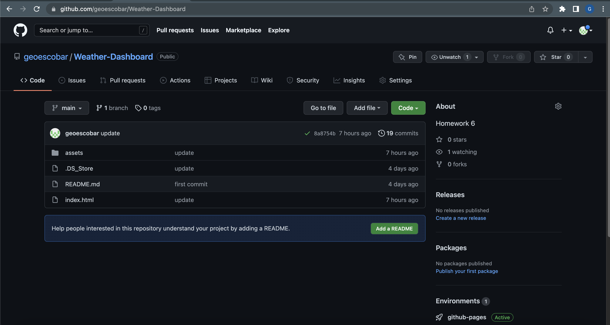
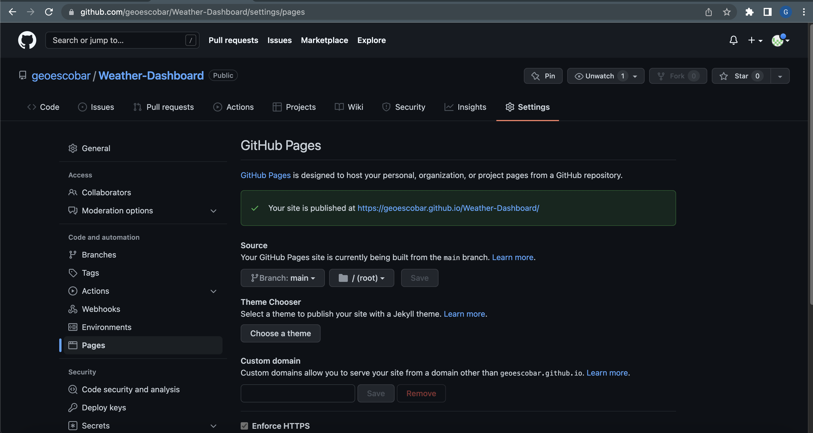
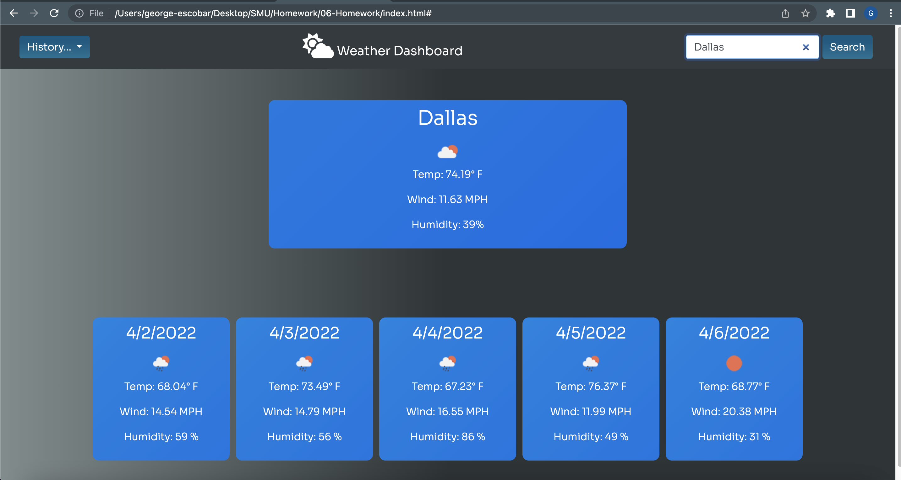

# Weather Dashboard

  Create a javascript based weather dashboard using the openweathermap api to pull live info on current climates around the world. 
  ---
  ## License

  MIT License
  

  ---
## Table of Contents:

- [License](#license)
- [Description](#description)
- [Links](#links)
- [Installation](#installation)
- [Questions](#questions)

  ---
  ## Description

  #### Languages Used
  
  	* html
	* css
	* javascript
	* bootstrap

  
  #### Why did you build this project?
  
  * To provide a simple and easy way to have a weather application handy. This also showcases some of my css and styling abilities and creative process. 
  
  #### What problem does it solve?
  
  * This solves the issue of having to go to the weather channel or other competitors that may have an excess of information and ads that is taking away from the key pieces of information the user really wants. 
  
  #### What challenges did you face?
  
  * Working with local storage to get it to store the most recent cities. With the help of my professor and google I was able to find a solution and get a good understanding of the concepts.
  
  #### What did you learn?
  
  * I learned how to properyl fetch data from API's and how to implement them into HTML. I also learned how to use local storage to use it as a history bar for recent cities searched. 
  
  ---
  ## Links 
  
  #### [Github Repo](https://github.com/geoescobar/Weather-Dashboard)
  

  #### [Github Pages](https://geoescobar.github.io/Weather-Dashboard/)
  
  

  ---

  ## Installation
  * Open the Github Pages link 

  ---
  ## Questions 

  #### If you have questions regarding this repository? Below is my contact info:

  * github.com/geoescobar
  * geo.escobar214@gmail.com

